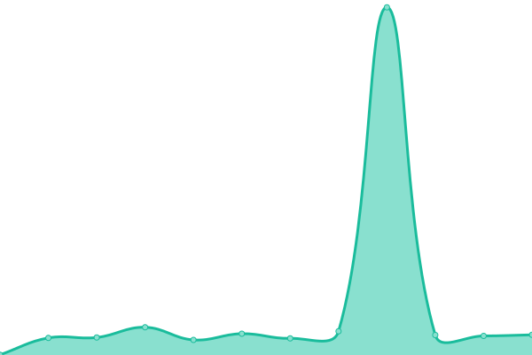

# [📈 Live Status](https://paupradel.github.io/infode-up): <!--live status--> **🟧 Partial outage**

This repository contains the open-source uptime monitor and status page for [Pradel](https://www.linkedin.com/in/paulina-pradel/), powered by [Upptime](https://github.com/upptime/upptime).

With [Upptime](https://upptime.js.org), you can get your own unlimited and free uptime monitor and status page, powered entirely by a GitHub repository. We use [Issues](https://github.com/paupradel/infode-up/issues) as incident reports, [Actions](https://github.com/paupradel/infode-up/actions) as uptime monitors, and [Pages](https://paupradel.github.io/infode-up) for the status page.

<!--start: status pages-->
<!-- This summary is generated by Upptime (https://github.com/upptime/upptime) -->
<!-- Do not edit this manually, your changes will be overwritten -->
<!-- prettier-ignore -->
| URL | Status | History | Response Time | Uptime |
| --- | ------ | ------- | ------------- | ------ |
|  [info delitos prod](https://info-delitos.cdmx.gob.mx}) | 🟥 Down | [info-delitos-prod.yml](https://github.com/paupradel/infode-up/commits/HEAD/history/info-delitos-prod.yml) | 

 0ms
     
 | 

<a href="https://paupradel.github.io/infode-up/history/info-delitos-prod">5.15%</a>
    

|  [info delitos preprod](https://info-delitos.pre.cdmx.gob.mx) | 🟩 Up | [info-delitos-preprod.yml](https://github.com/paupradel/infode-up/commits/HEAD/history/info-delitos-preprod.yml) | 

 319ms
     
 | 

<a href="https://paupradel.github.io/infode-up/history/info-delitos-preprod">100.00%</a>
    

|  [info delitos dev](https://info-delitos.des.cdmx.gob.mx) | 🟥 Down | [info-delitos-dev.yml](https://github.com/paupradel/infode-up/commits/HEAD/history/info-delitos-dev.yml) | 

 0ms
     
 | 

<a href="https://paupradel.github.io/infode-up/history/info-delitos-dev">43.98%</a>
    

|  [Google (prueba)](https://www.google.com) | 🟩 Up | [google-prueba.yml](https://github.com/paupradel/infode-up/commits/HEAD/history/google-prueba.yml) | 

 106ms
     
 | 

<a href="https://paupradel.github.io/infode-up/history/google-prueba">100.00%</a>
    

<!--end: status pages-->

[**Visit our status website →**](https://paupradel.github.io/infode-up)

## 📄 License

- Powered by: [Upptime](https://github.com/upptime/upptime)
- Code: [MIT](./LICENSE) © [Anand Chowdhary](https://anandchowdhary.com), supported by [Pabio](https://pabio.com)
- Data in the `./history` directory: [Open Database License](https://opendatacommons.org/licenses/odbl/1-0/)
